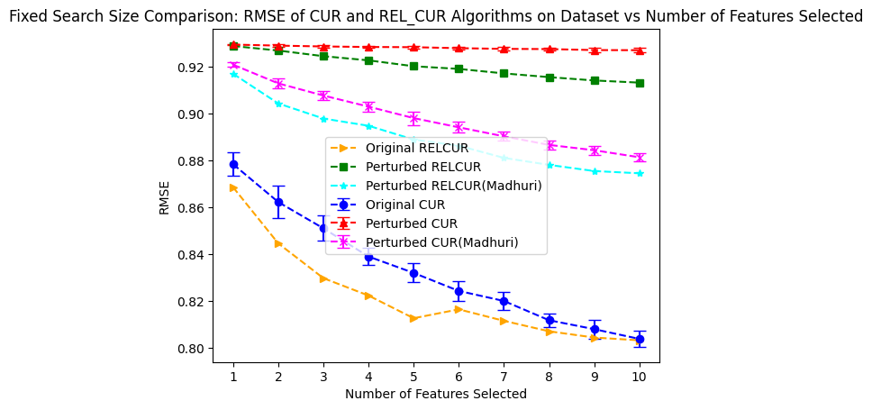

# Applying Differential Privacy to Matrix Factorization

Here i have added CUR and relative error Matrix Factorization methods to implement differential privacy.

as per [paper](https://machinelearningmastery.com/plot-a-decision-surface-for-machine-learning/)

### DIFFERENTIALLY PRIVATE MF
1. Input Perturbation
2. In-process Mechanisms
3. Output Perturbation


for better understanding:

 nv gn
njgjfngkrtn

dataset:

ml-100k

My Implementation:
in given paper [paper](https://machinelearningmastery.com/plot-a-decision-surface-for-machine-learning/) we got better rusults for Input Perturbation method with mentioned matrix factorization.
```
I have changed :
1. input pertubation code 
2. matrix factorization to CUR and Relative Error CUR
to see the results:
```

```
1. Original RELCUR: relative error cur on original dataset

2. Perturbed RELCUR: relative error cur on pertubated dataset(as per paper)

3. Perturbed RELCUR(Madhuri): relative error cur on pertubated dataset(as per my changes)

4. Original CUR:cur on original dataset

5. Perturbed CUR:cur on pertubated dataset(as per paper)

6. Perturbed CUR(Madhuri):relative error cur on pertubated dataset(as per my changes)

```

After CUR and relative CUR implementation:
i check my pertubated datasets on it:




## Reference:
```
1. https://shlomo-berkovsky.github.io/files/pdf/RecSys15a.pdf
2. https://www.stat.berkeley.edu/~mmahoney/talks/CUR_relerr.pdf
```